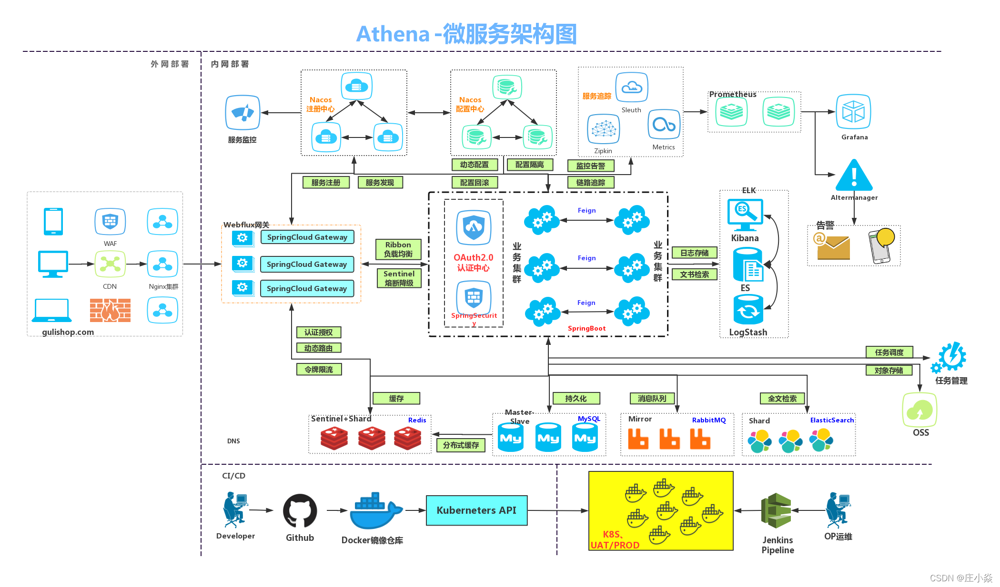
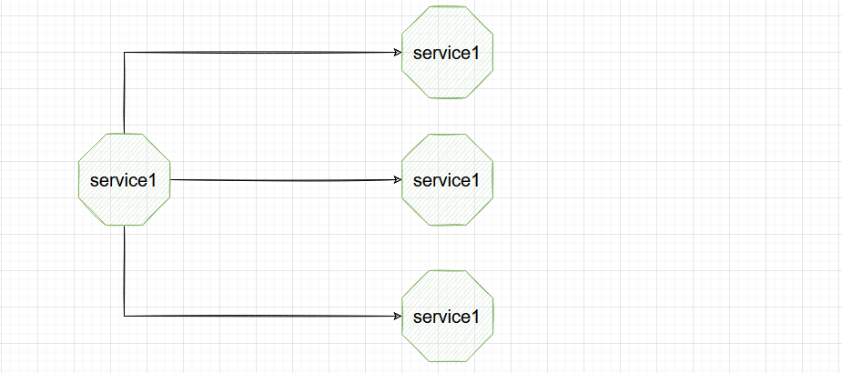
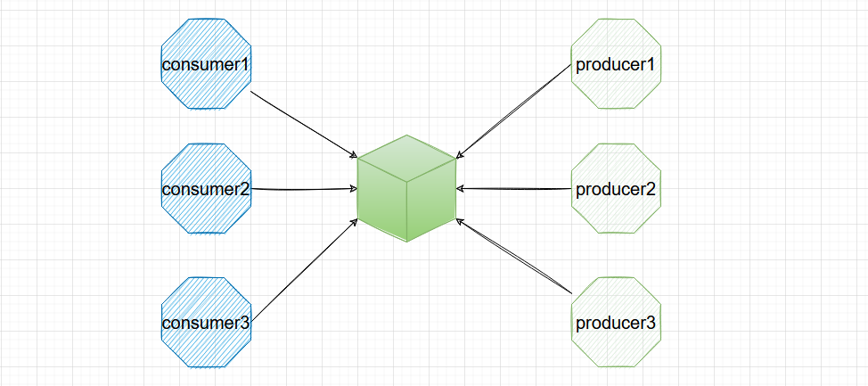

# Athena项目背景和系统架构

## Athena项目背景介绍

市面上有5种常见的电商模式 B2B、B2C、C2B、C2C、O2O，B2B(Business to Business)，是指商家和商家建立的商业关系，如阿里巴巴。
B2C(Business to Consumer) 就是我们经常看到的供应商直接把商品买个户，即 “商对客” 模式，也就是我们呢说的商业零售，直接面向消费销
售产品和服务，如苏宁易购，京东，天猫，小米商城。C2B (Customer to Business),即消费者对企业，先有消费者需求产生而后有企业生产，
即先有消费者提出需求，后又生产企业按需求组织生产，C2C (Customer to Consumer) 客户之间把自己的东西放到网上去卖。如淘宝、咸鱼。
O2O 即 Online To Offline，也即将线下商务的机会与互联网结合在一起，让互联网成为线上交易前台，线上快速支付，线上优质服务，
如：饿了么，美团，淘票票，京东到家。Athena是一个B2C模式的电商平台，销售自营商品给客户。

## 系统项目架构原理

### 系统前端
前后分离开发，分为内网部署和外网部署，外网是面向公众访问的。访问前端项目，可以有手机APP，电脑网页；
内网部署的是后端集群，前端在页面上操作发送请求到后端，在这途中会经过Nginx集群，Nginx把请求转交给API网关(springcloud gateway)
（网关可以根据当前请求动态地路由到指定的服务，看当前请求是想调用商品服务还是购物车服务还是检索服务），
从路由过来如果请求很多，可以负载均衡地调用商品服务器中一台（商品服务复制了多份），
当商品服务器出现问题也可以在网关层面对服务进行熔断或降级（使用阿里的sentinel组件），
网关还有其他的功能如认证授权、限流（只放行部分到服务器）等。

### 管理系统后端
- 到达服务器后进行处理（springboot为微服务），服务与服务可能会相互调用（使用feign组件），
- 有些请求可能经过登录才能进行（基于OAuth2.0的认证中心。安全和权限使用springSecurity控制）

### 系统基础服务
- 服务可能保存了一些数据或者需要使用缓存，我们使用redis集群（分片+哨兵集群）。
- 持久化使用mysql，读写分离和分库分表。
- 服务和服务之间会使用消息队列（RabbitMQ），来完成异步解耦，分布式事务的一致性。

### 系统的检索
- 有些服务可能需要全文检索，检索商品信息，使用ElaticSearch。
- 服务可能需要存取数据，使用阿里云的对象存储服务OSS。

### 系统的日志
- 项目上线后为了快速定位问题，使用ELK对日志进行处理，使用LogStash收集业务里的各种日志，
- 把日志存储到ES中，用Kibana可视化页面从ES中检索出相关信息，帮助我们快速定位问题所在。

### 系统服务注册与发现
在分布式系统中，由于我们每个服务都可能部署在很多台机器，服务和服务可能相互调用，
就得知道彼此都在哪里，所以需要将所有服务都注册到注册中心。服务从注册中心发现其他服务所在位置（使用阿里Nacos作为注册中心）。
每个服务的配置众多，为了实现改一处配置相同配置就同步更改，就需要配置中心，也使用阿里的Nacos，服务从配置中心中动态取配置。

### 系统的监控与跟踪
服务追踪，追踪服务调用链哪里出现问题，使用springcloud提供的Sleuth、Zipkin、Metrics，
把每个服务的信息交给开源的Prometheus进行聚合分析，再由Grafana进行可视化展示，
提供Prometheus提供的AlterManager实时得到服务的警告信息，以短信/邮件的方式告知服务开发人员。

### 系统的CICD
还提供了持续集成和持续部署。项目发布起来后，因为微服务众多，每一个都打包部署到服务器太麻烦，
有了持续集成后开发人员可以将修改后的代码提交到github，运维人员可以通过自动化工具Jenkins Pipeline
将github中获取的代码打包成docker镜像，最终是由k8s集成docker服务，将服务以docker容器的方式运行。

## 系统微服务划分架构

反映了需要创建的微服务以及相关技术。项目采取的是前后分离开发。
前端项目分为admin-vue（工作人员使用的后台管理系统）、shop-vue（面向公众访问的web网站）、app（公众）、小程序（公众）

### 系统微服务类别
商品服务：商品的增删改查、商品的上下架、商品详情
支付服务：调用第三方支付平台进行否建
优惠服务：系统的商品优惠服务
用户服务：用户的个人中心、收货地址
仓储服务：商品的库存
秒杀服务：商品的秒杀服务
订单服务：订单增删改查
检索服务：商品的检索ES
OSS服务：登录、注册、单点登录、社交登录
购物车服务:购物车的服务。
后台管理系统：添加优惠信息等

## 项目技术&特色

- 前后分离开发，并开发基于vue的后台管理系统
- SpringCloud全新的解决方案
- 应用监控、限流、网关、熔断降级等分布式方案
- 分布式事务，分布式锁等分布式系统的难点
- 数据库、系统、分布式缓存压力测试与性能优化
- Zookeeper MQ redis集群技术原理以及使用
- git jenkins SonarQube等……
- docker k8s和kubesphere的学习与使用

### 微服务设计原理
微服务架构风格，就像是把一个单独的应用程序开发成一套小服务，每个小服务运行在自己的进程中，并使用轻量级机制通信，
通常是 HTTP API 这些服务围绕业务能力来构建，	并通过完全自动化部署机制来独立部署，
这些服务使用不同的编程语言书写，以及不同数据存储技术，并保持最低限度的集中式管理
简而言之，拒绝大型单体应用，基于业务边界进行服务微化拆分，每个服务独立部署运行。

### 集群&分布式&节点

集群是个物理状态，分布式是个工作方式，只要是一堆机器，也可以叫做集群，他们是不是一起协作干活，这谁也不知道。
分布式系统是若干独立计算机的集合，这些计算机对于用户来说像单个系统，分布式系统 (distributed system) 是建立网络之上的软件系统
分布式是指根据不同的业务分布在不同的地方。集群指的是将几台服务器集中在一起，实现同一业务

例如：京东是一个分布式系统，众多业务运行在不同的机器上，所有业务构成一个大型的分布式业务集群，每一个小的业务，
比如用户系统，访问压力大的时候一台服务器是不够的，我们就应该将用户系统部署到多个服务器，也就是每一个业务系统也可以做集群化
分布式中的每一个节点，都可以做集群，而集群并不一定就是分布式的。节点：集群中的一个服务器。

### 系统远程调用RPC原理
在分布式系统中，各个服务可能处于不同主机，但是服务之间不可避免的需要互相调用，我们称之为远程调用，
SpringCloud中使用HTTP+JSON的方式来完成远程调用。

### 系统远负载均衡

分布式系统中，A 服务需要调用B服务，B服务在多台机器中都存在，A调用任意一个服务器均可完成功能
为了使每一个服务器都不要太或者太闲，我们可以负载均衡调用每一个服务器，提升网站的健壮性
常见的负载均衡算法：
轮询：为第一个请求选择健康池中的每一个后端服务器，然后按顺序往后依次选择，直到最后一个，然后循环
最小连接：优先选择链接数最少，也就是压力最小的后端服务器，在会话较长的情况下可以考虑采取这种方式

### 服务注册/发现&注册中心
A服务调用B服务，A服务不知道B服务当前在哪几台服务器上有，哪些正常的，哪些服务已经下线，解决这个问题可以引入注册中心
如果某些服务下线，我们其他人可以实时的感知到其他服务的状态，从而避免调用不可用的服务

每一个服务最终都有大量配置，并且每个服务都可能部署在多个服务器上，我们经常需要变更配置，我们可以让每个服务在配置中心获取自己的配置。
配置中心用来集中管理微服务的配置信息

### 服务熔断&服务降级

在微服务架构中，微服务之间通过网络来进行通信，存在相互依赖，当其中一个服务不可用时，
有可能会造成雪崩效应，要防止这种情况， 必须要有容错机制来保护服务。

情景：订单服务 --> 商品服务 --> 库存服务
库存服务出现故障导致响应慢，导致商品服务需要等待，可能等到10s后库存服务才能响应。
库存服务的不可用导致商品服务阻塞，商品服务等的期间，订单服务也处于阻塞。
一个服务不可用导致整个服务链都阻塞。如果是高并发，第一个请求调用后阻塞10s得不到结果，第二个请求直接阻塞10s。
更多的请求进来导致请求积压，全部阻塞，最终服务器的资源耗尽。导致雪崩

1、服务熔断
设置服务的超时，当被调用的服务经常失败到达某个阈值，我们可以开启断路保
护机制，后来的请求不再去调用这个服务，本地直接返回默认的数据

2、服务降级
在运维期间，当系统处于高峰期，系统资源紧张，我们可以让非核心业务降级运行，降级：某些服务不处理，或者简单处理【抛异常，返回NULL，调用
Mock数据，调用 FallBack 处理逻辑】

### API 网关

在微服务架构中，API Gateway 作为整体架构的重要组件，抽象服务中需要的公共功能，
同时它提供了客户端负载均衡，服务自动熔断，灰度发布，统一认证，限流监控，日志统计等丰富功能，帮助我们解决很多API管理的难题

