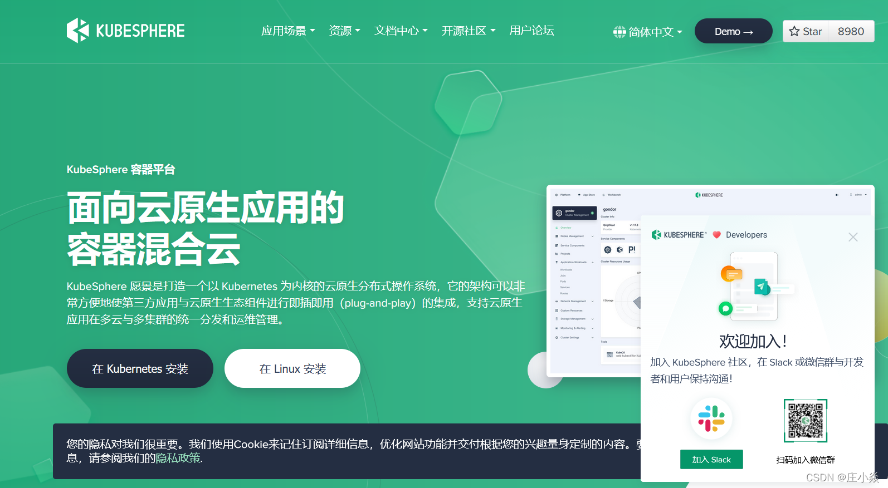

# Athena系统开发环境的部署

本博文主要是使用的KubeSphere来实现Kubernetes集群管理，以此更好的构建Athena系统中所设计到的基础的环境，
例如：nacos、mysql、redis、MQ、ES、等基础容器，同时为系统的管理和项目的部署提供的一个一站式的环境管理。
构建系统整体的架构设计与系统测试，CICD等。结合Github实现对code的质量的管理与控制。
为系统在真实的互联网下的上线做好相关前置准备。

## KubeSphere平台构建
### 2.1KubeSphere容器平台
KubeSphere 愿景是打造一个以 Kubernetes 为内核的云原生分布式操作系统，
它的架构可以非常方便地使第三方应用与云原生生态组件进行即插即用（plug-and-play）的集成，
支持云原生应用在多云与多集群的统一分发和运维管理。

### 2.2 KubeSphere安装构建
由于个人资源有限，因此在构建整体系统采用的单节点构建KubeSphere容器平台。
在后期的项目真实的上线的时候可能多集群架构来实现的项目的安装与部署工作。
同时后期本人将介绍相关的实战内容。

## mysql的安装

## redis的安装

## Elasticsearch的安装

## nacos的安装

